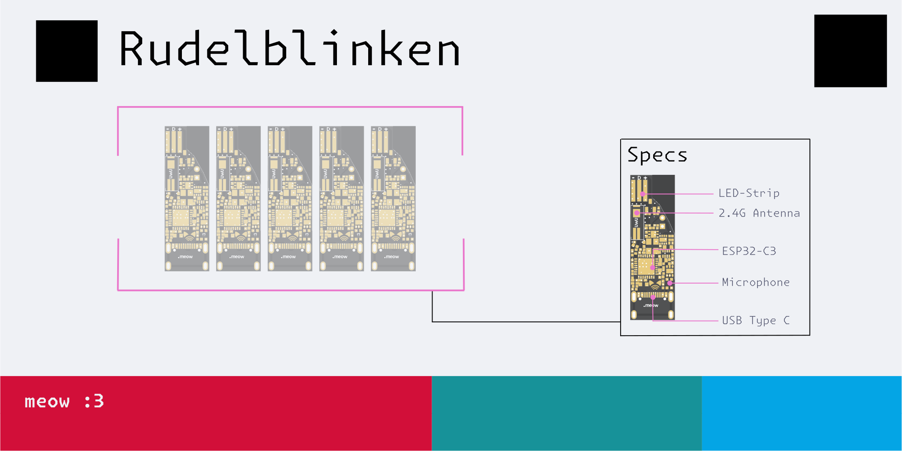
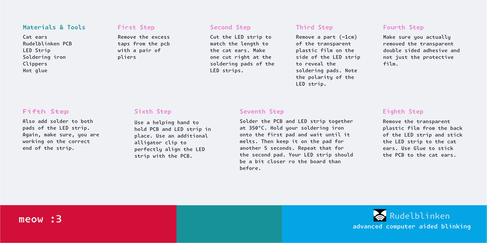
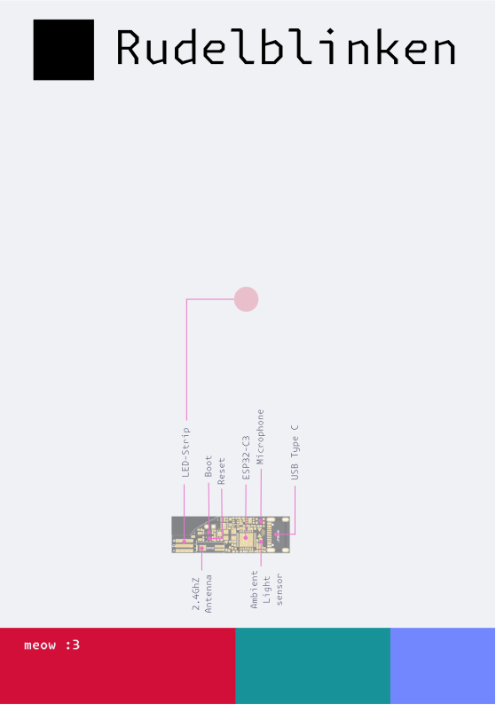
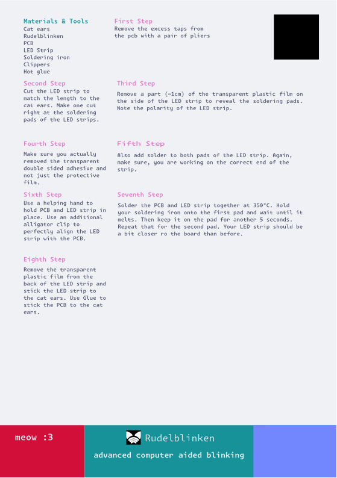

# Rudelshipping
Packaging for [Rudelblinken](https://github.com/zebreus/rudelblinken-rs) cat ears

## How to Print
* Print the PDF for the SixBoard-Design in the format `DIN-Lang-Quer` and the RudelKit-Design in `DIN-A5-Quer`
* 250-400g cardboard is recommended  
* Cheap printing companys in germany are: [Saxoprint](https://www.saxoprint.de), [wir-machen-druck.de](https://www.wir-machen-druck.de) or [Flyeralarm](https://www.flyeralarm.com)

## How to Package
* Cut 47.5-50cm of LED strips
* Stick the components with balloon glue to the card
* Put the card in an envelope, recommended are `Versandtaschen DIN Lang` for the SixBoard-Design and `Versandtaschen DIN A5` for the RudelKit-Design, both made out of 250g cardboard

## Shipping Cost
* If you use thinner cardboard, the `Kompaktbrief` (1,10€) is recommended. For everything else use the `Großbrief` (1,80€).
* For bigger shipments it can be cheaper to put everything in a small box and send it via DHL

## colorpalettes
* [Catppuccin Latte](https://catppuccin.com/palette/), 
* [uchū](https://uchu.style/)

## Fonts
* [Monaspace](https://monaspace.githubnext.com/)

## Designs
### SixBoard

### RudelKit

